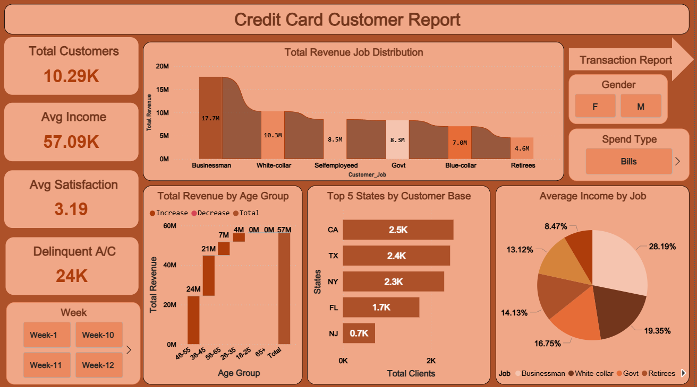
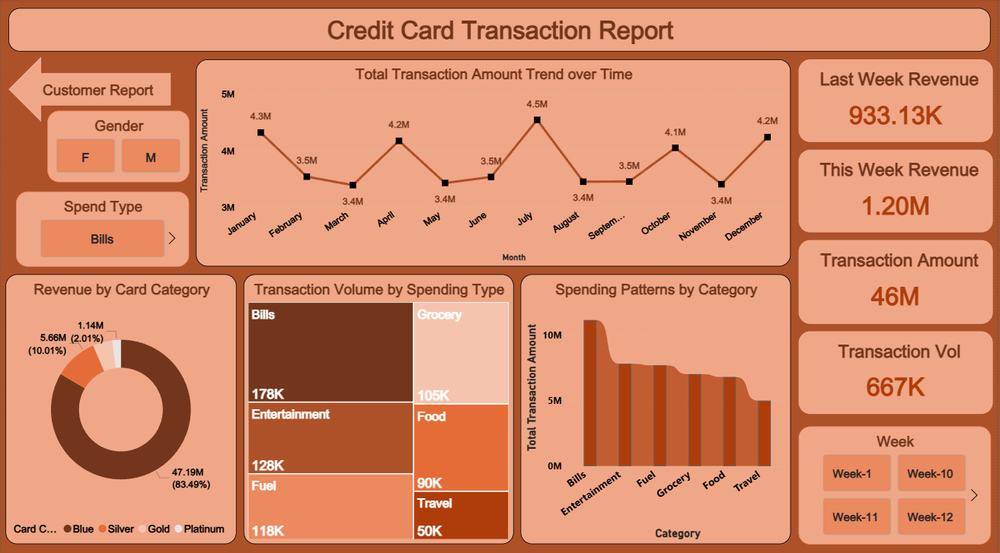

# Power BI Credit Card Analytics & Weekly Status Dashboard

## Project Background
Welcome to the Credit Card Weekly Status Report repository. This portfolio project showcases an advanced Power BI solution built to convert disparate transactional logs and customer records into a cohesive, interactive business intelligence suite. By exploring spending habits, transaction volumes, and demographic details, this tool empowers portfolio managers to make agile, data-backed decisions.

## The Business Problem Statement
The core obstacle was the fragmentation of existing data. With customer profiles living in one dataset and transaction logs in another, leadership struggled to map spending behaviors to specific demographic segments. The goal was to engineer a unified, dynamic reporting environment. This tool needed to calculate complex week-over-week (WoW) financial growth while allowing stakeholders to slice the data instantly by income, age, gender, and timeframe.

## Technical Implementation & DAX Engineering

> Use File `Dashboard Report.pbix`

To build a highly responsive and accurate visualization suite, I executed a strict data modeling and transformation workflow:

* **Relational Data Modeling:** Forged a unified schema by linking the separate customer and transaction datasets via their primary keys.
* **Complex Data Wrangling:** Overcame a major time-intelligence hurdle where native "Week" data was stored as text strings. I utilized DAX `SUBSTITUTE` and `VALUE` functions to strip the text and generate a pure integer column, which successfully enabled accurate `MAX()` evaluations and week-over-week comparisons.
* **Custom Segmentation:** Built calculated columns using DAX to group users into targeted 'Age Groups' and 'Income Groups' (categorized as Low, Medium, and High) for deeper demographic slicing.
* **Financial DAX Measures:** Programmed robust measures to automatically calculate 'Total Revenue', 'Current Week Revenue', and 'Previous Week Revenue'.

## The BI Dashboards
The final product features two specialized, cross-filtering dashboards designed for distinct analytical needs:

### 1. The Customer Demographics View
This report zeroes in on the user base. It features dedicated slicers for Income Group, Age Group, and Gender, giving stakeholders an immediate, interactive breakdown of customer financial standing and profile distribution.

### 2. The Transaction & Operations View
This page focuses heavily on purchasing mechanics. Users can filter by Week, Gender, and Spending Category to monitor exactly where capital is flowing. It also provides a detailed breakdown of preferred payment architectures, including Swipe, Chip, and Online transactions.

## Strategic Business Recommendations
Leveraging the interactive capabilities of these dashboards reveals several key growth opportunities for the credit card portfolio:

* **Double Down on High-Value Demographics:** The visualizations prove that the lion's share of transaction volume originates from specific education and income brackets. Acquisition and retention budgets should be heavily weighted toward these segments.
* **Tailor Rewards by Gender:** The 'Expenditure Type' data shows clear divergence in spending categories between male and female cardholders. The business should launch gender-optimized promotional campaigns and reward multipliers to match these distinct purchasing habits.
* **Fortify Preferred Payment Channels:** With the vast majority of volume flowing through Chip and Swipe methods, maintaining a frictionless and highly secure infrastructure for physical payments is absolutely paramount to preserving transaction completion rates and overall user satisfaction.
